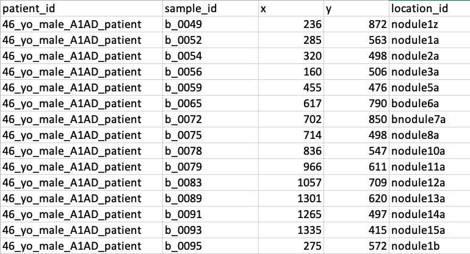

# Generation of interactive mapscape plots from phylogenetic trees reconstructed from NDP-clustered mutations

## This branch is for generating annotated interactive [plots](PD51606b/PD51606b_mapscape_241205.html)

## Process
Run locally on your machine

## Requirements
 1. .png formated static image of histology section microbiopsies were generated from:


2. A table indicating x/y pixel position of each microbiopsy:
    - I generate these using photoshop determining the position of my cursor
    - The location_id field must be unique

 

3. An image of a phylogenetic tree (e.g. signature-annotated) and optionally a second tree (e.g. with and without tumours plotted). The tree file is expected to be in the same directory as the H&E image, be .png formatted, and be named:
    - first 7 characters "_SigFit_annotated.png"
    - PD51606_SigFit_annotated.png
    
    In this case this is the tree without the signature annotation.


If a second file is given, it is expected to be:
- first 7 characters "_static_tree.png"
- PD51606_static_tree.png

The first tree will be the one plotted on the interactive plot

4.  Clonal Prevelence table, detailing how much of each clone each microbipsy sample has. By default this is generated by the ndp clustering as the "cluster_and_samples.csv" file

 

5.  Cluster and spectrum plots pdf, for display the clustering from NDP. By default this is generated by the ndp clustering as the "Cluster_and_spectrum_plots.pdf" file. This needs to be in the same directory as the "Prevalence Table"


6. Edge table from NDP tree of clone structure. Generated automatically by the ndp tree building script.

 

7. .phylo format of same tree, used for determining colour scheme. It is expected to be in the same directory as the edge table, ending in .phylo and share the first 7 characters (PD51606). 

8. Optionally, a mutation table indicating the mutations, vaf, and cluster assignment of each mutation in each sample. Generated by default by ndp tree building. For display, mutations will be filtered to only include those that are protein-altering. Driver mutations can be indicated as "DRIVER" in the Driver column to be easily searchable.
required columns:
- Chrom
- Coord
- Gene
- Protein
- Effect 
- Driver
- cluster_id

 

## Notes
- For simplicity sample names are shortened to just the last 6 digits, rather than full names. So PD51606b_lo0052 becomes c_lo0052. Sample names used in location table should reflect this.
- Samples which do not have any clone present at >= 0.01 will be removed, otherwise mapscape fails to generate an image
- Visualisation of the clones present in a sample doesn't truely reflect the nesting of clones within each other. Nor does it allow for a sample to be filled in at less than 100%.
- Plotting parameters (size of trees, size of image etc) are mostly handled by the underlying javascript file and are not currently parameters. 

## Javascript files
- Tim Butler has updated the javascript files installed by mapscape to improve the visualisation of the plotting. 
    - The updated javascript files are in the javascript_files folder. To implement these you need to overwrite the one installed by default
    - /Library/R/4.0(or whatever R version you have)/library/mapscape/htmlwidgets/mapscape.js
    - /Library/R/4.0(or whatever R version you have)/library/mapscape/htmlwidgets/lib/mapscape_helpers.js
    - the changes made are indicated and explained in the comments (search tb14).

## Usage
To be run locally on your machine, should take less than a min to run.

```
./mapscape_generation.sh
- SAMPLE_NAME
- IMAGE_FILE (must be .png formatted)
- LOCATION_TABLE (x/y pixel positions of micropsies on .png image)
- CLONAL_PREVELANCE_TABLE (cluster_and_samples.csv output by ndp clustering)
- EDGE_TBL (tree edge table output by ndp tree generation)
- LOW_PREV (TRUE or FALSE, whether to include only clones present >0.01, reccomened FALSE)
- OUTPUT_DIRECTORY (where .html output file will be saved)
- MUTATION_TABLE (Option paramenter, table of annotated mutaitons and which samples, and clones those are assigned to)
```
```
./mapscape_generation.sh \
PD51606b \
PD51606b/PD51606b_img.png \
PD51606b/PD51606b_loc_tbl.xlsx \
PD51606b/cluster_and_samples.csv \
PD51606b/PD51606b.edge_tbl.csv \
FALSE \
PD51606b/ \
PD51606b/PD51606b_mutation_file.csv
```

## Acknowledgments

This repository builds on the functionality of the [`mapscape`](https://www.bioconductor.org/packages/devel/bioc/vignettes/mapscape/inst/doc/mapscape_vignette.html) package, developed for visualising spatial clonal evolution. For more details, refer to the original vignette: [MapScape Vignette](https://www.bioconductor.org/packages/devel/bioc/vignettes/mapscape/inst/doc/mapscape_vignette.html).

The modifications in this repository were developed by Tim Butler to adapt `mapscape` to work with data generated by laser capture microdissection (LCM) and processed using our somatic mutation calling pipelines. These changes allow compatibility with the data generated for this project.

The modifications in this repository were initially developed in Tim Butler's internal repository. For internal Sanger users, the original page can be accessed [here](https://gitlab.internal.sanger.ac.uk/tb14/mapscape-generator).

